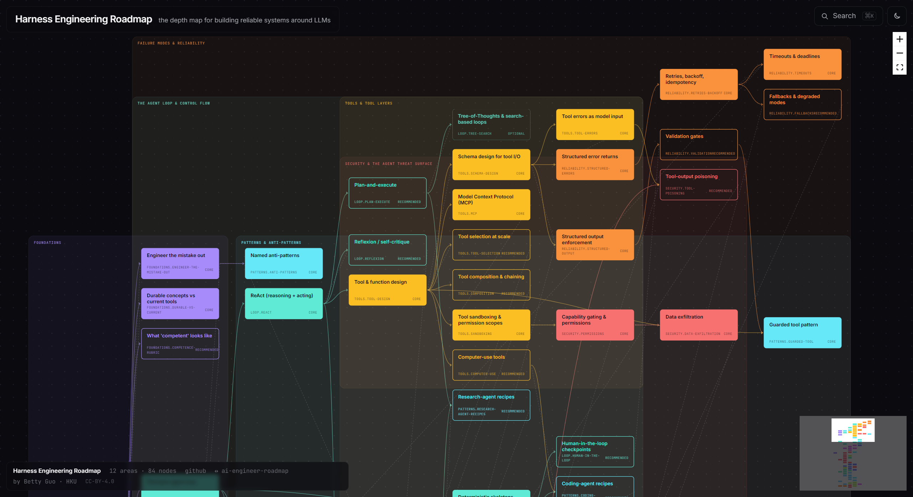

# Harness Engineering Roadmap

> An interactive roadmap for **harness engineering** — building the agent loop, tool layers, context engineering, memory, retrieval, eval harnesses, and the rest of the scaffolding around modern LLMs. Curated by an active AI researcher.

**[ Live site → bettyguo.github.io/harness-engineer-roadmap ](https://bettyguo.github.io/harness-engineer-roadmap)**

---

## Why this exists

Your agent works in the demo and breaks in production. **This is the map for getting good at the engineering around the model** — the discipline most agent projects skip and then die from.

- 88% of agent projects don't reach production. The model is rarely the reason. *The harness* — everything around the model — is.
- "Harness engineering" was named in **February 2026** ([Mitchell Hashimoto](https://mitchellh.com/writing/my-ai-adoption-journey)) and given a vocabulary in **April 2026** ([Birgitta Böckeler / ThoughtWorks](https://martinfowler.com/articles/harness-engineering.html)). The work has been around for years; the noun for it is new.
- This is the canonical interactive map. Twelve areas, 84 nodes, each clickable with a curated, web-verified resource panel.

## How to use this

- Land on the **[live site](https://bettyguo.github.io/harness-engineer-roadmap)** — use the diagram. Pan, zoom, click any node.
- Or browse the static markdown fallback in [`content/`](content/) if you prefer reading on GitHub.
- **Three reading paths** to get unstuck:
  - **"My agent breaks in prod"** → Foundations → Failure Modes & Reliability → Evals & Observability → Patterns & Anti-Patterns.
  - **"I'm scaling beyond one agent"** → Multi-Agent Orchestration → Memory & State → Cost & Latency → Security.
  - **"I'm new to harness engineering"** → Foundations → The Agent Loop → Tools & Tool Layers → Context Engineering → Patterns.

## Scope — depth, not breadth

This is the **depth** map of one craft. For the broader AI-engineer career path (where harness engineering is one stage), see **[ai-engineer-roadmap](https://github.com/bettyguo/ai-engineer-roadmap)**. This roadmap assumes you already know where harness engineering sits.

## Sister roadmaps (standalone peers — not nested)

- **[ai-engineer-roadmap](https://github.com/bettyguo/ai-engineer-roadmap)** — the breadth map of the whole AI-engineer career path.
- **[llm-interview-prep](https://github.com/bettyguo/llm-interview-prep)** — agent/harness depth on the questioning side.
- **[build-your-own-ai](https://github.com/bettyguo/build-your-own-ai)** — practical agent-loop-from-scratch exercises.

## Maintenance & freshness

This field changes monthly. To keep the map trustworthy:

- Every resource is tagged **durable** (concept-level, ≥3-year shelf) or **current** (tool name, expect rotation).
- Links are checked nightly by CI. Broken links open issues automatically.
- Quarterly content sweep. Next: **August 2026**.
- Latest content sweep: see [CHANGELOG.md](CHANGELOG.md).

## Contribute

See [CONTRIBUTING.md](CONTRIBUTING.md). New resources require: a verification link, a "why this one" annotation (≤2 sentences), the durable-vs-current flag, and a passing `tools/validate_data.py`.

For new nodes: file a [`new_node`](.github/ISSUE_TEMPLATE/new_node.yml) issue first.

## Curator

**Betty Guo** (Dongxin Guo / 郭东欣)
Final-year PhD candidate, Computer Science, University of Hong Kong.
Advised by [Prof. Siu-Ming Yiu](https://www.cs.hku.hk/people/academic-staff/smyiu).

- GitHub: [@bettyguo](https://github.com/bettyguo)
- ORCID: [0009-0000-2388-1072](https://orcid.org/0009-0000-2388-1072)

## License

- **Code** (`site/`, `tools/`, root configs): MIT — see [LICENSE](LICENSE).
- **Content** (`roadmap-data/`, generated `content/`, `assets/`): CC-BY-4.0 — see [LICENSE-content](LICENSE-content).

---

